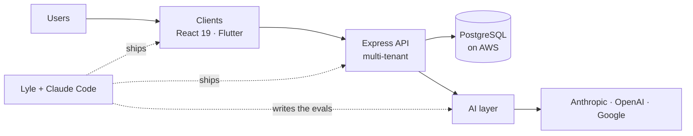

<!--
  ============================================================================
  PROFILE README  ·  github.com/lylelague   ·   variant: DEV-DOCS (package)
  ----------------------------------------------------------------------------
  Structure : reworked as technical documentation for a "package" —
              status badges · table of contents · install · usage (code) ·
              architecture (mermaid) · API reference (module table) ·
              examples · benchmarks · configuration · collapsible changelog
              & principles · contributing. Most detailed variant.
  Palette   : dark #0d1117 · violet accent #a371f7 · text #c9d1d9 · muted #8b949e
  Snake     : github-snake-dev.svg (violet) on the `output` branch, generated by
              the violet output added to .github/workflows/snake.yml.
  Content   : same facts as the other variants, documented in depth.
  ============================================================================
-->

# @lylelague/full-stack-developer

> One engineer, both ends of the request. Backend, the app that consumes it, the Flutter client in the field, and the AI systems around them.


A full-stack developer at **Ai2Aim**, remote from **Iloilo, Philippines (UTC+8)**, shipping a Canada-based enterprise HR platform across every layer — a 600K+ line codebase, AI-assisted end to end, then evaluated with benchmarks built to break the models it leans on.

## Table of contents

- [Install](#install)
- [Usage](#usage)
- [Architecture](#architecture)
- [API reference](#api-reference)
- [Examples](#examples)
- [Benchmarks](#benchmarks)
- [Configuration](#configuration)
- [Contributing](#contributing)

## Install

```bash
# one engineer, both ends of the request
npm i @lylelague/full-stack-developer

# peer dependencies: a dark theme, an LSP, and coffee
```

## Usage

```ts
import { Lyle } from '@lylelague/full-stack-developer';

const lyle = new Lyle({
  base: 'Iloilo, PH',
  timezone: 'UTC+8',
  remote: true,
  pairedWith: 'Claude Code',
});

// ships across every layer of the request
await lyle.build('enterprise-hr-platform');   // TS · Express · PostgreSQL · React 19
await lyle.ship('flutter-field-app');         // offline-first · GPS · geofencing
await lyle.evaluate('reasoning-benchmarks');  // adversarial — built to make LLMs fail

lyle.principles();
// => "say it once, plainly · returns 0 on merge · leaves the branch cleaner"
```

## Architecture



## API reference

| Module | Exports | Stack |
|---|---|---|
| `backend` | multi-tenant REST API · auth · audit trail | TypeScript · Express · Sequelize · PostgreSQL · AWS |
| `frontend` | the app that consumes the API | React 19 · Next.js · TypeScript |
| `mobile` | offline-first clients for the field | Flutter · Dart · Supabase |
| `ai` | assistant integration · adversarial evals | Anthropic · OpenAI · Google · MCP (Serena) |
| `tooling` | how it all ships | Git · Jest · Playwright · Claude Code |

## Examples

**`field-ops-app`** — role-aware GPS tracking, geofencing, offline-first sync, and route optimization for field crews.<br>
<sub>`Flutter` · `Supabase` · `OR-Tools`</sub>

**`fleet-tracker`** — real-time vehicle-fleet monitoring with foreground GPS and trip analytics.<br>
<sub>`Flutter` · `Vue` · `Supabase`</sub>

**`sports-meet-web`** — a regional sports-meet platform: schedules, live results, and a running medal tally.<br>
<sub>`Next.js` · `Supabase` · `shadcn`</sub>

**`gov-notify-rail`** — a proactive notification rail so government benefits and deadlines reach the citizen first.<br>
<sub>`eGovPH hackathon`</sub>

## Benchmarks

<div align="center">


</div>

## Configuration

```ini
BASE        = Iloilo, Philippines
TZ          = UTC+8
EMPLOYER    = Ai2Aim            # enterprise HR SaaS, Canada-based
MODE        = remote
SCALE       = 600000+ LOC
AI_PARTNER  = Claude Code
```

<details>
<summary><b>Changelog</b> — what's shipping now</summary>

```
[agents]  Claude Code + MCP (Serena, LSP-backed) — long autonomous runs, decision logs over hand-holding
[evals]   authoring adversarial reasoning benchmarks — false premises, intuition traps, counterfactuals
[audits]  Playwright mobile-responsiveness sweeps and security passes on production frontends
```
</details>

<details>
<summary><b>Design principles</b> — how it's built</summary>

```
- Say it once, plainly. Flag disagreement early, then commit.
- Prefer one dense paragraph to three padded ones.
- Read the code before changing the code.
- Optimize for whoever maintains this in six months.
- Copy-paste-ready beats almost-ready. Return 0 on merge.
```
</details>

## Contributing

Issues, DMs, and pull requests welcome. Fastest paths:

[](https://github.com/lylelague)
[](mailto:lyle.lague@ai2aim.ai)
[](https://www.linkedin.com/in/lyle-lague-244148387)
[](https://x.com/lylengqt)

<sub>MIT © Lyle Lague — leaves the branch cleaner than it found it.</sub>
