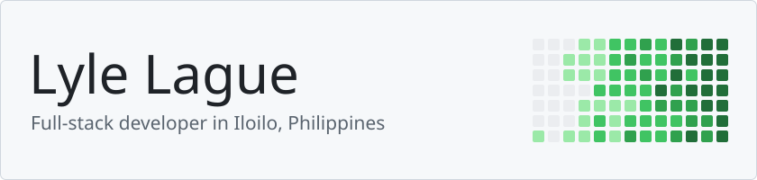
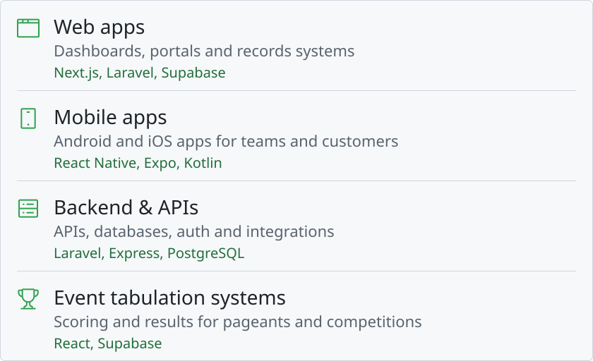
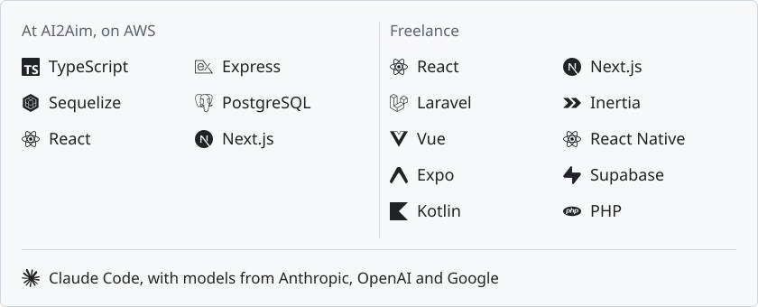
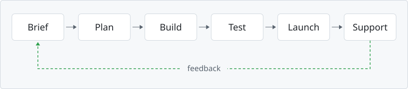
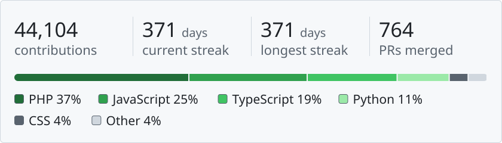

<!--
  Profile README for github.com/lylelague.

  Every image is drawn by scripts/profile/ in GitHub's own colors, in a light and a dark
  version; the <picture> elements pick the one matching the viewer's theme.
    node scripts/profile/build-static.mjs   header, services, stack, workflow (rerun after copy edits)
    node scripts/profile/build-stats.mjs    stats, rebuilt daily by .github/workflows/grs.yml
  Snake: github-contribution-grid-snake{-dark}.svg on the `output` branch, from snake.yml.
-->

<picture>
  <source media="(prefers-color-scheme: dark)" srcset="./profile/header-dark.svg">
  
</picture>
  

I'm Lyle, a full-stack developer at AI2Aim, working remotely from Iloilo in the Philippines (UTC+8).

I'm part of a Canada-based team building an enterprise HR platform. I work on the Express and PostgreSQL API and on the React app that runs on it. The codebase is past 600,000 lines. I write my part with AI help from start to finish, then write the evals that try to break what the AI helped me ship.

Outside AI2Aim I take freelance work, building web and mobile apps with React, Next.js, Laravel, React Native and Supabase.

Working with me is simple. Say it once, plainly. I raise disagreement early, then commit, and I leave the branch cleaner than I found it.

### What I can build for you

<picture>
  <source media="(prefers-color-scheme: dark)" srcset="./profile/services-dark.svg">
  
</picture>

### What I use

<picture>
  <source media="(prefers-color-scheme: dark)" srcset="./profile/stack-dark.svg">
  
</picture>

### How a project runs

<picture>
  <source media="(prefers-color-scheme: dark)" srcset="./profile/workflow-dark.svg">
  
</picture>

### On GitHub

<picture>
  <source media="(prefers-color-scheme: dark)" srcset="./profile/stats-dark.svg">
  
</picture>

<picture>
  <source media="(prefers-color-scheme: dark)" srcset="https://raw.githubusercontent.com/lylelague/lylelague/output/github-contribution-grid-snake-dark.svg">
  
</picture>

### Get in touch

Email me at [lyletacsagonlague@gmail.com](mailto:lyletacsagonlague@gmail.com), or find me on [LinkedIn](https://www.linkedin.com/in/lyle-lague-244148387) and [X](https://x.com/lylengqt).
